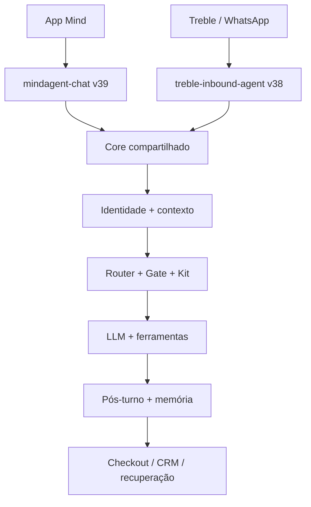

# MAPA DO SISTEMA — Agentes do Mind

> Estado operacional verificado em **04/09/2026**. Snapshot do repositório:
> `main` em `44d831018772b39a764dd311b9cc839a9e2d1c43`.
>
> Produção vence `main`; `main` vence planos e snapshots antigos.

## 1. Visão geral

Canal é adapter, não arquitetura. App e WhatsApp compartilham identidade, contexto,
Router, Capability Gate, Kit, decisioning, guardrails e pós-turno.

## 2. Entradas e runtimes

| entrada | runtime | responsabilidade |
|---|---|---|
| App Mind | `mindagent-chat` v39 | Concierge, jornada contextual, venda permitida e modo Play |
| Treble/WhatsApp | `treble-inbound-agent` v38 | inbound B2C/B2B, persistência e resposta |
| checkout curto | `mindagent-checkout` v1 | atribuição, clique e redirect oficial |
| recuperação | `mindagent-recovery` v2 | preparação controlada da retomada |
| HubSpot | `hubspot-commercial-writeback` v3 | preview/apply controlado de Contact e Lead |
| conhecimento | `mindagent-index-knowledge` v1 | indexação administrativa de embeddings |

## 3. Pipeline comum

1. Persistir conversa/mensagem e resolver a pessoa canônica.
2. Montar `AGENT_CONTEXT` com dados permitidos do canal e da rota.
3. Resolver rota quando necessário.
4. Aplicar Capability Gate antes de carregar ou executar capacidades.
5. Compor Kit: base, playbook, decisioning, fatos estruturados e ferramentas.
6. Executar o modelo e, quando necessário, busca ou ação permitida.
7. Aplicar guardrails, devolver a resposta e registrar eventos.
8. Rodar análise pós-turno, memória e candidatos de continuidade.

## 4. Casas canônicas

| domínio | estruturas principais |
|---|---|
| pessoa e identidade | `pessoas.pessoas`, `engagement.identidades`, `engagement.identidade_fusoes` |
| conversa | `engagement.conversas`, `engagement.mensagens`, `engagement.agente_eventos` |
| contexto e memória | `intelligence.analise_conversa`, `intelligence.participante_memoria`, `intelligence.dossies` |
| recuperação | `intelligence.recovery_inbox`, `engagement.recovery_dispatch_queue` |
| CRM | `crm.contato_espelho`, `crm.pipeline_leads_inbound`, `crm.hubspot_commercial_writeback` |
| Summit | `summit_2026.sessions`, `session_speakers`, `events`, `offers`, `event_rules` |
| conhecimento | `summit_2026`, `eventos`, `institute` e `dash`: `knowledge_documents/chunks` |
| governança agêntica | `agentes.prompts`, `agentes.kit_blocos`, `agentes.canal_competencia` |

## 5. Regras de segurança

- rota não concede capacidade; o Gate decide por rota, canal, agente e contexto;
- preço, desconto, oferta e checkout vêm somente de fonte oficial do Kit;
- busca semântica complementa fatos estruturados e deve manter fallback lexical;
- memória durável exige evidência, finalidade e proteção contra dado sensível;
- recuperação/outbound e write-back real permanecem atrás de gates explícitos;
- Edge Functions não são consideradas publicadas apenas porque o código foi mesclado.

## 6. Estado observável

Em 04/09/2026: 1.779 memórias, 935 análises, 815 itens no inbox de recuperação,
fila de disparo zerada, 77 sessões, 81 vínculos sessão–palestrante e 64 palestrantes.
Esses números servem para operação e podem mudar.

Para retomar: [`CHECKPOINT_ATUAL.md`](CHECKPOINT_ATUAL.md). Para arquitetura e
decisões: [`PROJECT_STATE.md`](PROJECT_STATE.md). Para contratos detalhados:
[`docs/CORE_UNIVERSAL.md`](docs/CORE_UNIVERSAL.md).
