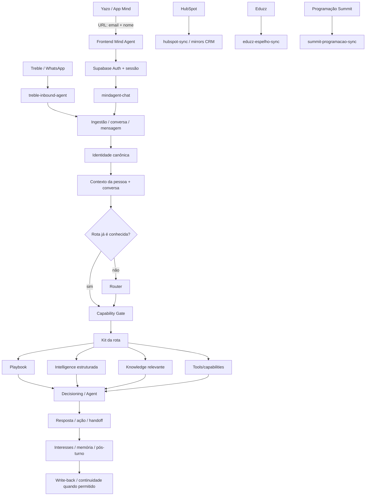
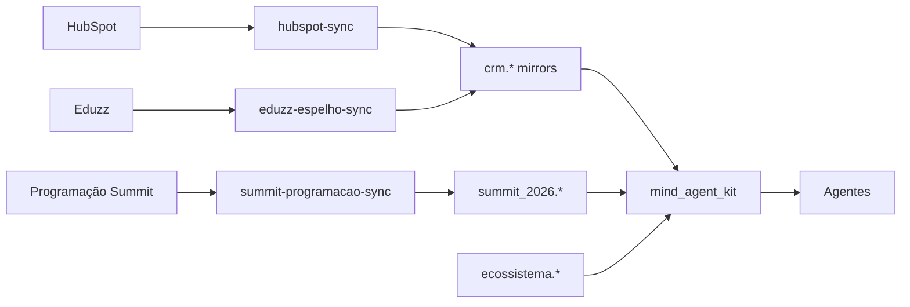

# MAPA DO SISTEMA — Agentes do Mind

> Mapa operacional do sistema **como ele existe agora**, não arquitetura futura.
>
> Snapshot técnico: `main` em `a4189dea60da304b5db40f2a1673342be0b4b9e2` — merge da Lane C (#50), noite de 30/08/2026 BRT / 31/08 UTC.
>
> Regra de leitura: **produção vence `main`; `main` vence PR; PR/issue mais recente vence checkpoint antigo.**
>
> Para decisões congeladas: [`PROJECT_STATE.md`](PROJECT_STATE.md). Para retomada operacional: [`CHECKPOINT_ATUAL.md`](CHECKPOINT_ATUAL.md). Para o Core detalhado: [`docs/CORE_UNIVERSAL.md`](docs/CORE_UNIVERSAL.md).

---

## 1. O sistema em uma página



### Linguagem canônica

| camada | responsabilidade |
|---|---|
| **INTELLIGENCE** | o que é verdade agora |
| **PLAYBOOK** | como um excelente profissional pensa e atua |
| **DECISIONING** | qual estratégia faz sentido agora |
| **AGENT** | o que efetivamente diz ou faz |

**PLAYBOOK decide como pensar. INTELLIGENCE informa o que é verdade agora.**

---

## 2. Casas canônicas

### Pessoa e identidade

- `pessoas.pessoas.id` = **`pessoa_id` canônico e permanente**.
- `engagement.identidades` = evidências/identificadores como e-mail, WhatsApp, HubSpot e auth.
- Nome **não identifica sozinho**.
- Conflito de identificadores não faz auto-merge; vira pendência.

Porta canônica de identidade:

- `public.mind_identidade_resolver(...)`

No app/Concierge existe ainda o bind específico da sessão web:

- `public.mindagent_chat_bind_identity(..., p_email text)`

Esse RPC atualmente recebe **e-mail**, não nome.

### Conversa e mensagens

As superfícies convergem para o mesmo eixo de pessoa/conversa no Core. A regra é persistir a fala antes de etapas que podem falhar.

Funções centrais:

- `public.mind_inbound(...)`
- `public.mind_conversa_resolver(...)`
- `public.mind_mensagem_registrar(...)`
- `public.mind_turno_registrar(...)`

### CRM

Source externa: HubSpot.

Mirror local:

- `crm.contato_espelho`
- `crm.pipeline_de_vendas_summit`
- `crm.vendas_historicas_mind_summit`
- `crm.empenho_summit_2026`
- `crm.pipeline_leads_inbound`

Caminho canônico:

```text
pessoa_id
→ engagement.identidades (canal = hubspot)
→ HubSpot Contact ID
→ crm.contato_espelho.hubspot_id
```

### Produto / evento

- `catalogo.produtos` = vocabulário canônico de produto + registry comercial.
- `summit_2026.*` = Product Intelligence do Summit.
- `ecossistema.palestrantes_especialistas` = inteligência perene/curada de palestrantes e especialistas.

### Prompts / playbooks

- `agentes.prompts` = casa canônica dos playbooks consumidos pelo Core.
- `concierge.prompts` permanece histórico/compatibilidade; não é a nova casa autoritativa do playbook do Concierge.

---

## 3. Core compartilhado

### Contexto

- `public.mind_agent_context(p_conversa_id uuid)`

Contexto síncrono compartilhado da pessoa/conversa. Product Intelligence mutável não deve ser persistida aqui como blob.

### Router

Usado **só quando a rota não veio determinada pelo canal/produto**.

Rotas canônicas:

- `summit_b2c`
- `summit_b2b`
- `institute`
- `dash`
- `cliente_suporte`
- `concierge_summit`

`ja_comprou` e `desconhecido` não são rotas.

Existe também a Edge `router` em produção.

### Capability Gate

- `public.mind_rota_capacidade(p_rota, p_canal)`

O Gate não escolhe estratégia e não muda rota. Só responde se a rota pode ser executada naquele canal com a capacidade disponível.

### Kit Loader

- `public.mind_agent_kit(p_rota, p_conversa_id, p_necessidade)`

Providers relevantes já vivos:

- `public.mind_kit_evento(...)`
- `public.mind_kit_programacao(...)`

O Agent recebe a verdade pelo Kit; não deve conhecer a topologia física das tabelas.

Regra:

```text
estruturado autoritativo primeiro
→ RAG/knowledge apenas para long-tail
```

Preço, desconto, checkout, horário, inclusão e disponibilidade não dependem de RAG como fonte da verdade.

---

## 4. Fluxo real do App / Yazo / Concierge

### Entrada de identidade

A Yazo abre o app assim:

```text
/?email=usuario%40email.com&nome=Usuario
```

Fluxo real no frontend:

```text
Yazo
→ config.js captura email + nome da URL
→ limpa email/nome da barra de endereço
→ guarda identidade da aba em sessionStorage por até 12h
→ app.js usa nome para saudação
→ chat-service.js envia identity para mindagent-chat
```

Prioridade de identidade no frontend:

1. query string da Yazo;
2. `sessionStorage` da mesma aba;
3. anônimo.

### Distinção fundamental

**E-mail identifica. Nome não.**

Hoje:

- `nome` é usado na experiência do frontend e viaja no payload;
- `email` é o identificador determinístico usado pelo bind canônico;
- `mindagent_chat_bind_identity` recebe `p_email` e resolve a pessoa;
- não deve existir uma segunda identidade “Yazo” nem uma pessoa paralela criada pelo app.

### Sessão

`chat-service.js`:

```text
Supabase Auth anônimo
→ access/refresh token
→ device_id local
→ sessão canônica do mindagent-chat
```

Auth, sessão e `device_id` não são identidade de pessoa; são identidade/contexto técnico do acesso.

### Runtime do Concierge — VIVO AGORA

Produção:

- Edge `mindagent-chat` **v24**, interna `VERSION = 1.5.0`;
- `verify_jwt=true`;
- migrations C aplicadas: `20260830223000`, `20260830233000`, `20260830233500`.

Fluxo de chat:

```text
App
→ Auth
→ mindagent-chat
→ start/resume session
→ bind_identity por email Yazo, quando existe
→ get_context
→ salva mensagem do usuário
→ Gate concierge_summit / mindagent-web
→ mind_agent_kit
   ├─ evento
   ├─ programação
   └─ playbook concierge_summit
→ OpenAI Responses API
→ salva resposta
→ salva interesses
→ devolve resposta + sessão
```

Não há Router neste fluxo porque a rota é conhecida por construção: **`concierge_summit`**.

O runtime é fail-closed: sem Gate aberto, Kit disponível, playbook, evento ou programação, a LLM não é chamada para improvisar.

### OpenAI

A OpenAI recebe contexto oficial montado pelo servidor. E-mail e telefone são mascarados/omitidos do conteúdo enviado ao modelo.

O navegador nunca recebe `service_role` nem `OPENAI_API_KEY`.

---

## 5. Play — o que já existe e o que ainda falta

A `mindagent-chat` v24 já contém o **executor do modo ação** e reutiliza:

- mesmo endpoint;
- mesma Auth;
- mesma sessão;
- mesmo bind de identidade;
- mesma conversa.

Isso significa que uma pessoa identificada pela Yazo pode entrar direto no Play **sem conversar antes com o Concierge**.

Allowlist já presente no runtime:

- `registrar_feedback_sessao`
- `registrar_nps`
- `registrar_feedback_evento`
- `registrar_feedback`

Porém os writers da Lane E **ainda não existem em produção**. Portanto o transporte/executor já está vivo, mas a coleta completa ainda não está fechada.

Casas já existentes para Play:

- `engagement.sessao_feedback`
- `engagement.nps`
- `engagement.evento_feedback`
- `engagement.feedbacks`
- `concierge.ferramenta_chamadas` para ledger/idempotência de transporte.

**Não criar backend, sessão ou identidade paralelos para Play.**

---

## 6. Fluxo real do Treble / WhatsApp

### Vivo em produção agora

Edge:

- `treble-inbound-agent` versão Supabase **25**;
- código interno **v1.3.0**;
- `verify_jwt=false` porque recebe webhook protegido pelo token próprio;
- flag `core_rota_kit` está **ausente**, portanto desligada.

Fluxo vivo legado:

```text
Treble
→ treble-inbound-agent v1.3.0
→ valida token
→ persiste mensagem/conversa via treble_agent_start
→ carrega contexto + prompt Treble
→ opcionalmente busca programação
→ OpenAI
→ identifica e-mail somente quando o modelo conclui que é o e-mail do próprio lead
→ completa perfil quando aplicável
→ registra turno
→ devolve resposta_ia + needs_human + estado para Treble
```

### Novo runtime B — integrado, ainda não ativado

O código da Lane B já está em `main` e a migration `20260830210000` já está em produção, mas a Edge nova ainda não substituiu a v1.3.0 viva.

Novo caminho preparado:

```text
Treble
→ ingestão / identidade / contexto
→ Router
→ Capability Gate
→ Kit
→ guardrail comercial
→ Agent
→ resposta / handoff
```

Somente `summit_b2c` e `summit_b2b` entram no caminho comercial novo; rotas não migradas preservam compatibilidade controlada.

### Gate real para ativação B

Falta o número WhatsApp controlado para o smoke físico. O DoD exige a resposta chegar no aparelho, não apenas HTTP 200.

Até isso existir:

- não publicar/ativar a Edge nova às cegas;
- não ligar `core_rota_kit`;
- não usar telefone real arbitrário como fixture.

---

## 7. Memória e pós-turno

### O que existe hoje

- `intelligence.participante_memoria` já recebe memória/interesses de caminhos existentes.
- `intelligence.memoria_bloqueios` contém a taxonomia canônica de sensibilidade.
- `mindagent_chat_save_interests(...)` já existe e o Concierge v24 envia `sensitivity` por interesse.
- Edge `analisar-conversa` está ativa.
- Edge `silence-reavaliar` está ativa.

### O que ainda não está integrado

Lane D permanece aberta:

- `public.mind_memoria_fatos(...)` ainda não existe em produção;
- migrations `20260830234000` e `20260830234500` ainda não estão aplicadas;
- memória legada sem `sensitivity='none'` não deve ser exposta ao Agent;
- write-back material e outbound continuam dentro dos gates correspondentes;
- cron 13/outbound permanece desligado.

Ordem correta:

```text
C já integrado
→ D memória segura / pós-turno
→ E Play
```

---

## 8. Sources externas e mirrors



Princípio:

```text
SOURCE externa
→ SYNC / MIRROR local
→ KIT
→ AGENTE
```

Mirror não vira segunda fonte autoral só porque está no Supabase.

---

## 9. Edge Functions que participam do sistema

### Runtime / produto

- `mindagent-chat` — Concierge + executor Play.
- `treble-inbound-agent` — cérebro inbound do Treble/WhatsApp.
- `mindagent-bootstrap` — bootstrap de conteúdo do app; ainda existe fallback local no frontend.
- `router` — Router como serviço.

### Sync / Intelligence

- `hubspot-sync`
- `eduzz-espelho-sync`
- `summit-programacao-sync`
- `mindagent-sync-precos`

### Pós-turno / continuidade

- `analisar-conversa`
- `silence-reavaliar`

### Operacional / compatibilidade Treble

- `treble-agent`
- `treble-api`
- `treble-webhook`
- `treble-sessoes-sync`
- `treble-status-hubspot`
- `treble-find-location`
- `treble-disparo` — existe, mas existência da Edge **não autoriza outbound**.

### Diagnóstico / administração

- `mindagent-admin`
- `hubspot-diag`
- `treble-diag`
- `eduzz-diag`

---

## 10. Vivo × integrado × pendente

| capacidade | produção agora | `main` | observação |
|---|---|---|---|
| Core identidade/conversa/contexto | **vivo** | integrado | base compartilhada |
| Router + Gate + Kit | **vivos** | integrado | usados pelo Concierge; B novo ainda não ativado |
| Vendedor B2C/B2B Core | **não ativado no Treble** | **integrado** | Edge Treble viva ainda é v1.3.0; flag ausente |
| Concierge chat Core | **vivo** | **integrado** | `mindagent-chat` v24 / 1.5.0 |
| Yazo email+nome na URL | **vivo no frontend** | **integrado** | e-mail identifica; nome personaliza |
| Play executor | **vivo na Edge** | **integrado** | writers E ainda ausentes |
| Play coleta completa | não | PR E | writers/frontend ainda precisam integrar |
| memória segura para leitura | não | PR D | coletor/gates D ainda não em produção |
| pós-turno completo / write-back | parcial | PR D | gates de CRM/outbound permanecem |
| outbound automático | **não autorizado** | — | cron 13 off |

---

## 11. Legado que não pode virar arquitetura nova

### `mind_lead_capturar`

A Edge Treble **viva v1.3.0 ainda chama** `mind_lead_capturar`.

A Lane B nova já remove essa chamada do código versionado. Portanto:

- isso é **legado vivo temporário**, não capacidade a preservar;
- não criar nem reconstruir `mind_lead_capturar` para acomodar o runtime novo.

### IDs CRM legados

Não usar como caminho canônico de leitura:

- `pessoas.pessoas.hubspot_id`
- `crm.contato_espelho.pessoa_id`

O caminho é por `engagement.identidades`.

### `concierge.prompts`

Permanece histórico/compatibilidade. Não duplicar ali o playbook canônico novo.

### JSON local do app

`dados/summit.json` é fallback real para evitar tela vazia quando bootstrap não entrega conteúdo suficiente. Não é source of truth nova e não deve ser transformado em backend paralelo.

### Taxonomia Treble antiga

`audience = b2c / b2b / ja_comprou / desconhecido` pertence ao runtime legado. Não deve competir com as rotas canônicas do Core.

---

## 12. Dependências reais para fechar o sistema atual

### B — Vendedor

Dependência externa real:

- número WhatsApp controlado para E2E físico.

Depois:

```text
publicar treble-inbound-agent nova
→ ligar flag
→ smoke B2C/B2B/handoff
→ confirmar entrega física
→ rollback da flag se necessário
```

### D — Memória / pós-turno

C já está integrado. Próxima dependência técnica é integrar D na ordem de migrations e então fazer o wiring seguro da leitura/pós-turno.

### E — Play

Depende de D entrar antes na ordem de integração/migrations. O executor C já existe; falta integrar writers + frontend e provar E2E person-bound.

---

## 13. Menor mudança recomendada a partir daqui

**Não criar arquitetura nova.** O sistema já tem as peças centrais.

Ordem mínima:

```text
1. manter B estacionada somente no gate externo do telefone de teste
2. integrar D sem ampliar escopo
3. integrar E depois de D
4. fechar E2E Play real pela entrada Yazo
5. quando houver telefone controlado, ativar e validar B
6. só então atualizar os documentos de estado para refletir o sistema final vivo
```

O E2E do app deve começar pela entrada real:

```text
URL Yazo com email + nome
→ app
→ mesma pessoa canônica
→ Concierge
→ Play
→ memória/interesses autorizados
→ nenhuma segunda identidade
```

---

## 14. Contradições importantes entre desenho antigo e sistema real

1. **Yazo não é uma identidade a construir.** A captura `email + nome` pela URL já existe. O que precisa ser provado é o E2E até a mesma `pessoa_id`.
2. **Nome não é chave de identidade.** Mesmo vindo da Yazo, ele não substitui e-mail/auth/WhatsApp como evidência determinística.
3. **Concierge já usa Gate + Kit em produção.** Documentos que ainda dizem que Gate/Kit estão fora do runtime ficaram desatualizados para essa rota.
4. **Play não precisa de segundo endpoint/lifecycle.** O executor já está dentro da `mindagent-chat` viva.
5. **B está integrado no Git, mas não é o runtime vivo do WhatsApp.** A Edge de produção ainda é v1.3.0 e o flag do Core está ausente.
6. **O runtime Treble vivo ainda contém `mind_lead_capturar`, mas o sistema novo deliberadamente não o preserva.** Não usar legado vivo como prova de que precisamos recriá-lo.
7. **Merge não significa publicação de Edge.** Neste repo, migrations/app e Edge Functions têm boundaries diferentes.

---

## 15. Regra para manter este mapa útil

Atualizar este arquivo apenas quando uma mudança alterar **o modelo mental do sistema**, por exemplo:

- uma lane passa de preparada para viva;
- muda uma casa canônica;
- muda o fluxo de identidade;
- entra ou sai uma Edge do caminho principal;
- muda a ordem real de execução;
- uma peça marcada como legado deixa de existir.

Não transformar este mapa em changelog de commits pequenos. Para detalhe operacional, usar issues/PRs e `CHECKPOINT_ATUAL.md`.
